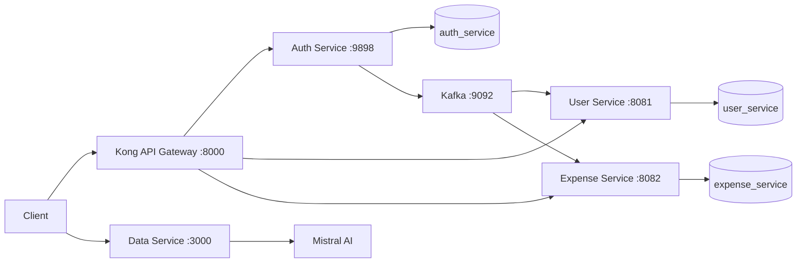

# Expense Tracker

Expense Tracker is a microservice-based backend for user authentication, user profiles, expense management, and AI-assisted transaction extraction from bank messages.

The repository combines Spring Boot services, a Flask data service, Kafka for asynchronous events, MySQL for persistence, and Kong as the API gateway.

## Architecture



## Services

| Component | Technology | Port | Purpose |
| --- | --- | ---: | --- |
| Auth Service | Java 21, Spring Boot, Spring Security | 9898 | Signup, login, JWT access tokens, and refresh tokens |
| User Service | Java 21, Spring Boot | 8081 | User-profile storage and Kafka event consumption |
| Expense Service | Java 21, Spring Boot | 8082 | Expense creation, retrieval, update, and deletion |
| Data Service | Python, Flask, LangChain | 3000 | Extracts structured expense details from bank messages |
| Kong | API gateway | 8000 | Routes public Auth, User, Expense, and Data Service API requests |
| MySQL | Database | 3306 | Stores authentication, user, and expense data |
| Kafka | Event broker | 9092 | Passes events between services |

> [!NOTE]
> Docker Compose starts MySQL, Kafka, all four application services, and Kong. The services can still be run separately during local development.

## Repository layout

```text
.
├── AuthService/       # Authentication and JWT service
├── UserService/       # User-profile service
├── expenseService/    # Expense CRUD service
├── dsService/         # Flask and Mistral AI data service
└── deployment/        # Docker Compose, Kong, and MySQL configuration
```

## Prerequisites

- Docker Desktop with Docker Compose
- Java 21
- Python 3.9 or newer for the Data Service
- A Mistral API key if you want to run the Data Service

The Java services include Gradle wrappers, so a separate Gradle installation is not required.

## Run the containerized stack

The Compose deployment expects the Auth, User, and Expense JARs in the ignored `Jars/` directory. Build and copy them from the repository root:

```bash
cd AuthService
./gradlew clean bootJar
cd ../UserService
./gradlew clean bootJar
cd ../expenseService
./gradlew clean bootJar
cd ..

mkdir -p Jars
cp AuthService/build/libs/authService-0.0.1-SNAPSHOT.jar Jars/
cp UserService/build/libs/userService-0.0.1-SNAPSHOT.jar Jars/
cp expenseService/build/libs/expenseService-0.0.1-SNAPSHOT.jar Jars/
```

Start the stack:

```bash
docker compose -f deployment/docker-compose.yml up --build
```

Once the containers are healthy, Kong exposes the gateway at `http://localhost:8000`.

To stop the stack:

```bash
docker compose -f deployment/docker-compose.yml down
```

Add `-v` only when you also want to delete the local MySQL volume:

```bash
docker compose -f deployment/docker-compose.yml down -v
```

## Run services locally

Start only the infrastructure:

```bash
docker compose -f deployment/docker-compose.yml up -d mysql kafka
```

Run each Java service in a separate terminal.

Auth Service:

```bash
cd AuthService
MYSQL_HOST=localhost \
SPRING_DATASOURCE_PASSWORD=password \
SPRING_KAFKA_PRODUCER_BOOTSTRAP_SERVERS=localhost:9092 \
./gradlew bootRun
```

User Service:

```bash
cd UserService
MYSQL_HOST=localhost \
MYSQL_USER=root \
MYSQL_PASSWORD=password \
SPRING_KAFKA_BOOTSTRAP_SERVERS=localhost:9092 \
./gradlew bootRun
```

Expense Service:

```bash
cd expenseService
MYSQL_HOST=localhost \
MYSQL_USER=root \
MYSQL_PASSWORD=password \
SPRING_KAFKA_BOOTSTRAP_SERVERS=localhost:9092 \
./gradlew bootRun
```

### Data Service

Create a virtual environment and install its current runtime dependencies:

```bash
cd dsService
python3 -m venv dsenv
source dsenv/bin/activate
pip install Flask python-dotenv langchain-core langchain-mistralai pydantic
```

Create `dsService/.env` locally:

```dotenv
MISTRAL_API_KEY=your_mistral_api_key
```

The file is ignored by Git and must never be committed. Start the service from its application directory so its local modules resolve correctly:

```bash
cd src/app
python __init__.py
```

## API overview

### Through Kong

| Method | Endpoint | Description |
| --- | --- | --- |
| `POST` | `/auth/v1/signup` | Register a user and return access/refresh tokens |
| `POST` | `/auth/v1/login` | Authenticate and return access/refresh tokens |
| `POST` | `/auth/v1/refreshToken` | Exchange a refresh token for an access token |
| `POST` | `/user/v1/createUpdate` | Create or update a user profile |
| `GET` | `/user/v1/getUser?userId=...` | Retrieve a user profile |
| `GET` | `/expense/v1/getExpense?user_id=...` | List a user's expenses |
| `POST` | `/expense/v1/addExpense` | Add an expense; requires the `X-User-Id` header |
| `PUT` | `/expense/v1/updateExpens` | Update an expense |
| `DELETE` | `/expense/v1/deleteExpense` | Delete an expense |
| `POST` | `/ds/v1/message` | Extract expense details from a bank message |

Example signup request:

```bash
curl -X POST http://localhost:8000/auth/v1/signup \
  -H 'Content-Type: application/json' \
  -d '{
    "user_id": "user-001",
    "username": "demo",
    "password": "change-me",
    "first_name": "Demo",
    "last_name": "User",
    "email": "demo@example.com"
  }'
```

### Direct service endpoints

| Method | Endpoint | Description |
| --- | --- | --- |
| `GET` | `http://localhost:8082/expense/v1/getExpense?user_id=...` | List a user's expenses |
| `POST` | `http://localhost:8082/expense/v1/addExpense` | Add an expense; requires the `X-User-Id` header |
| `PUT` | `http://localhost:8082/expense/v1/updateExpens` | Update an expense |
| `DELETE` | `http://localhost:8082/expense/v1/deleteExpense` | Delete an expense |
| `POST` | `http://localhost:3000/ds/v1/message` | Extract amount, merchant, and currency from a bank message |

Example Data Service request:

```bash
curl -X POST http://localhost:3000/ds/v1/message \
  -H 'Content-Type: application/json' \
  -d '{"message":"Your bank account was debited INR 499 at Example Store."}'
```

## Tests

Run each Java service's test suite with its Gradle wrapper:

```bash
cd AuthService && ./gradlew test
cd ../UserService && ./gradlew test
cd ../expenseService && ./gradlew test
```

## Configuration and security

- Keep API keys, passwords, tokens, and local `.env` files out of Git.
- Development passwords in `deployment/docker-compose.yml` are intended only for local use.
- Override database and Kafka settings with environment variables when running outside Docker.
- Rotate any credential immediately if it is accidentally committed, even after the file is removed from Git.
